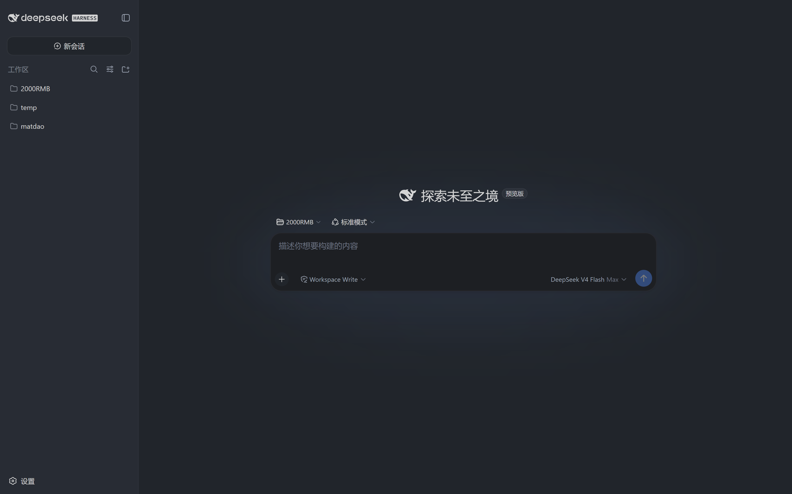
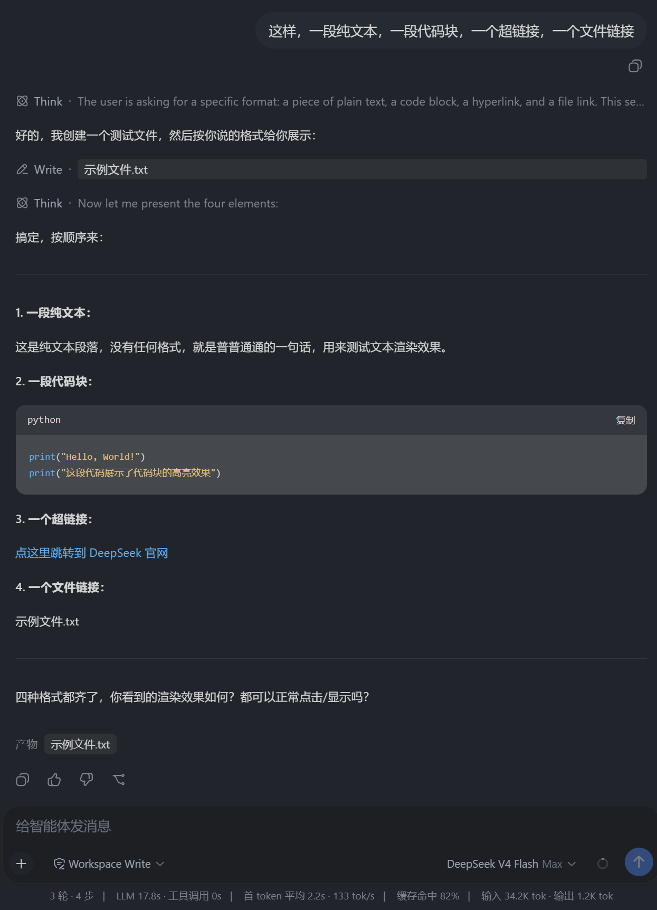

# dsh-theme · One Monokai（办公模式）

给 [DeepSeek Harness](https://github.com/deepseek-ai/deepseek-harness) Web UI 提供的 **One Monokai 办公模式**主题包。独立 CSS 覆盖层，不改动 dsh 源码，可一键部署 / 卸载。

> 目标：让 dsh 的 Web UI 从炫彩高科技显示屏回归传统的办公质感，缓解长时间使用的视觉疲劳。

## ✨ 特性

- **全面向 VS Code 的 One Monokai 看齐**：主文字降哑、链接蓝降饱和、背景严格对齐 `#282c34` 系
- **独立覆盖层**：只注入一个 `<link>`，不侵入 dsh 源码，升级 dsh 后重跑一次脚本即可恢复
- **一键部署 / 卸载**：自动定位仓库、注入主题、重启 dsh

## 📦 文件说明

| 文件 | 作用 |
|---|---|
| `one-monokai-office.css` | 主题本体（独立 CSS 覆盖层） |
| `deploy.ps1` | 一键部署 / 卸载脚本 |
| `LICENSE` | MIT 许可证（含原主题版权声明） |

## 🚀 快速开始

```powershell
# 部署（自动定位仓库 + 重启 dsh）
powershell -ExecutionPolicy Bypass -File deploy.ps1

# 指定仓库路径
powershell -ExecutionPolicy Bypass -File deploy.ps1 -Repo "D:\path\to\deepseek-harness"

# 卸载还原
powershell -ExecutionPolicy Bypass -File deploy.ps1 -Uninstall

# 部署但暂不重启（下次启动 dsh 时生效）
powershell -ExecutionPolicy Bypass -File deploy.ps1 -NoRestart
```

部署后刷新 `http://127.0.0.1:3080` 即可看到新主题。

## 📸 预览





## 🎨 主题设计要点

| 视觉问题 | 修改前 | 修改后（办公模式） |
|---|---|---|
| 主文字过亮（发光感） | `#d7dae0`（亮度 0.85） | `#abb2bf`（亮度 0.57，与 VS Code 一致） |
| 链接/强调蓝太艳 | 高饱和亮蓝 | `#61afef`（One Monokai 链接蓝） |
| 背景 | 偏蓝灰 | `#282c34` / `#21252B`（VS Code 同款） |
| 代码高亮 | 鲜亮 | One Monokai 全语法色（哑光） |
| 发光渐变文字 | 开 | 压掉 |

## 📜 版权与致谢

- 配色灵感来自 VS Code 主题 **[One Monokai](https://github.com/azemoh/vscode-one-monokai)**（作者 Joshua Azemoh，MIT License）
- 本项目遵循 MIT 许可证，详见 `LICENSE`
- 本主题非官方出品，来源于一个小巧思，由deepseek v4 flash完成主要工作